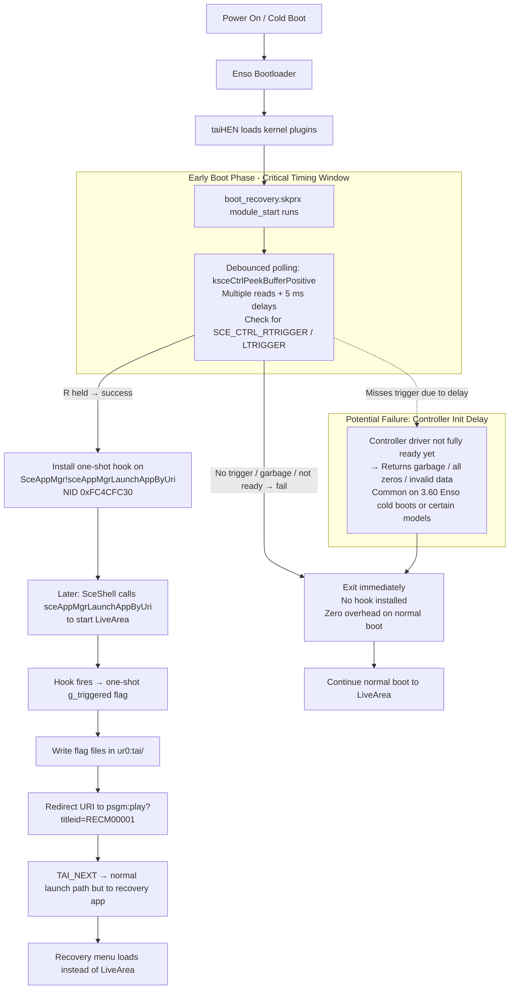

# PS Vita Recovery Menu Project

A diagnostic and recovery environment for the PlayStation Vita with plugin repair tools, storage diagnostics, and planned boot-time recovery via R trigger.

Hi! I'm Jose (@DrinkingSubset), and this is my first major homebrew project for the PS Vita.

I want to be completely transparent from the start:

I'm **not a full-time or professional developer**. For years, I've had this idea in the back of my mind — a proper, reliable custom recovery menu you could boot into by holding R, something that could really help save bricked or misconfigured Vitas. But learning to code from scratch, especially low-level Vita kernel stuff, felt overwhelming and out of reach.

Thanks to modern AI tools (especially Grok and others), I was finally able to turn that long-held dream into something real. **Most of the code in this project was written with significant help from AI**, which guided me through architecture decisions, fixed bugs, explained Vita-specific internals, and helped structure everything safely. I reviewed, tested, and tweaked every part myself on real hardware, but I could not have built this without that assistance.

I'm sharing this openly because I believe in transparency — especially in the homebrew community where trust and safety matter a lot. This project is a learning journey for me, and I'm proud of how far it's come, but it's far from perfect. If you find issues, have suggestions, or want to contribute fixes/improvements, please feel free to open an issue or pull request. I'd love to collaborate and make it even better together.

Thank you for trying it out, and thank you to the entire Vita homebrew community whose tools, plugins, and knowledge made this possible.

— DrinkingSubset ☣️🟩🥕⚡️🚀

March 2026

#### ⚠️ Disclaimer

**Read this carefully before using PS Vita Recovery Menu.**

This software is provided **as-is**, with no warranty of any kind. Use it entirely at your own risk.

### What this tool can and cannot do

PS Vita Recovery Menu is designed to assist with **software-level** issues on PS Vita systems running custom firmware (HENkaku, h-encore, h-encore2, Ensō). It can help recover from:

- Corrupted or misconfigured `config.txt` files
- Plugin conflicts causing boot loops
- Broken LiveArea databases
- Misconfigured storage mount points
- General CFW misconfigurations

**This tool cannot recover a fully hard-bricked PS Vita.** If your device does not power on, does not display anything on screen, or has suffered damage at the hardware or NAND level, no software tool — including this one — can help. A hard brick at the hardware level requires physical repair or specialized recovery equipment that is beyond the scope of this project.

### Risk of bricking

Certain operations available in this application — including but not limited to modifying system partitions, deleting core system files, resetting the tai configuration, or applying unsafe plugin configurations — **can result in a soft brick or, in worst-case scenarios, a hard brick of your PS Vita**, rendering it permanently unusable.

This applies to **all PS Vita models**, including:
- PS Vita PCH-1000 / PCH-1001 (OLED)
- PS Vita PCH-1100 / PCH-1101 (OLED 3G)
- PS Vita PCH-2000 / PCH-2001 (Slim LCD)
- PlayStation TV (VTE-1000 / CEM-3000)

### Your responsibility

By using this software, you acknowledge and accept that:

1. You are solely responsible for any damage, data loss, or bricking that occurs to your device.
2. The developer of PS Vita Recovery Menu bear no liability for any outcome resulting from the use of this software.
3. You have a basic understanding of PS Vita custom firmware and the risks involved in modifying system files.
4. You have backed up any important data before performing recovery or restoration operations.

### Recommendations before use

- Always back up `ux0:tai/config.txt` and `ur0:tai/config.txt` before making any changes.
- Use the **Backup tai/** function under Restore / Unbrick before proceeding with any repair operation.
- Test changes on one device before applying to others.
- If unsure about an operation, do not proceed.

**This tool is intended for experienced PS Vita CFW users who understand the risks. It is not a magic fix-all solution and should be treated with the same caution as any other system-level utility.**

### No Liability

The creator and developer of PS Vita Recovery Menu (**DrinkingSubset**) is **not responsible** for any damage, data loss, soft brick, hard brick, or any other consequence that occurs as a result of using this software. This includes but is not limited to: accidental deletion of system files, incorrect configuration changes, failed recovery attempts, or any unintended side effects on your device or data.

**You use this software at your own risk. Full stop.**

### Screenshot of the Main Recovery Menu

*Example of the main menu interface on a PS Vita 1000 (OLED)*

## PS Vita Recovery Menu v1.0

A powerful custom recovery environment for the PS Vita (and PSTV) running HENkaku Ensō.
Hold R trigger at power-on to boot directly into the recovery menu — before the LiveArea (SceShell) loads.
This project gives you a complete toolkit for plugin management, system diagnostics, unbricking, storage repair, and more — all from a single, safe boot-time entry point.

**Current status note:** The R-trigger boot redirect is fully coded and installs successfully, but it is not working yet on tested hardware (the kernel hook does not fire reliably). You can still launch the recovery menu normally from the bubble or via manual taiHEN entry. We are actively debugging the timing issue. The rest of the menu works perfectly.

## Features

### Main Menu
* Exit to LiveArea
* Plugins
* Advanced
* System Info
* Restore / Unbrick
* Plugin Fix Mode
* Sony Recovery
* Storage Manager
* File Manager
* Cheat Manager
* Reboot
* Power Off

### Plugins Manager
Toggle any plugin, remove duplicates, clean config.txt, re-enable missing files, save changes.

### Advanced Tools
* CPU Speed presets
* Registry Hacks
* Reset VSH (restart LiveArea)
* Suspend / Shut Down / Reboot
* System Write Mode (with full warning dialog — enables os0/vs0 writes)
* Boot Diagnostics (detailed health check) (still needs fixing)
* Boot Recovery Installer (one-click install/uninstall of the R-trigger plugin)

### System Information
Firmware, model (still needs fixing), Enso status (still needs fixing), motherboard (still needs fixing), clocks, battery health, memory, active tai config path, mount points (still needs fixing).

### Restore / Unbrick
* Safe Mode Boot
* Reset taiHEN config
* Backup / Restore ux0:tai/
* Rebuild LiveArea Database
* Official Sony recovery options

### Plugin Fix Mode
Safe Mode (disable all non-essential plugins), View & Toggle, Re-enable All, Reset to Minimal, Backup / Restore config.

### Sony Recovery
Exact replicas of Sony’s safe-mode options (Restart, Rebuild Database, Format Memory Card, Restore System, Update Firmware) with clear danger warnings.

### Storage Manager (SD2Vita)
* Card & Config Info
* Switch mount points (ux0 / uma0 / grw0)
* Install StorageMgr plugin
* Copy ux0 ↔ SD2Vita (both directions)
* Format SD card / Erase SD2Vita data (with red danger labels)

### File Manager
Full partition browser (ux0, ur0, vs0, os0, etc.) with create folder and operations support.

### Cheat Manager
* Vita Native Cheats (.psv) via VitaCheat
* PSP CWCheat (.db) support
* Changes saved to disk and applied on next game launch.

## Installation

Jailbreak required — HENkaku Ensō on firmware 3.60–3.74.
Download the latest PSVita-Recovery-Menu.vpk.
Install the VPK using VitaShell or molecularShell.
Launch the app once (bubble will appear as Title ID RECM00001).
Go to Boot Recovery Installer → Install Boot Recovery.
This copies boot_recovery.skprx to ur0:recovery/ and adds it under *KERNEL in your active tai config (ur0 or ux0).
A backup of your config.txt is automatically created.

Reboot.

To launch the menu normally (while R-trigger is being fixed):
Just open the recovery bubble from LiveArea.

## Build & Development

This project is built using the open-source **VitaSDK** toolchain.

Official site: https://vitasdk.org/
Documentation: https://docs.vitasdk.org/

Huge thanks to the VitaSDK team for making Vita homebrew development accessible and powerful. Without VitaSDK, recompiling and extending this project wouldn't be possible.

To build from source:
1. Install VitaSDK (follow https://vitasdk.org/getting-started/).
2. Set the `VITASDK` environment variable.
3. Run `cmake .` then `make` in the project root (uses CMakeLists.txt).
4. Output: .self and .vpk files ready for install.

Feel free to fork, tweak, and PR!

## How the R-Trigger Boot Plugin Works (Conceptual Flow)

  

## Credits & Thanks to the Homebrew Scenes

This recovery menu stands on the shoulders of giants. The PSP and PS Vita homebrew communities have been collaborative, innovative, and persistent for over two decades. Without their exploits, tools, libraries, and shared knowledge, none of this would exist.

### PSP Scene Pioneers (2005–2010) – The Revolution Begins

These trailblazers cracked the PSP wide open, creating the first homebrew enablers and Custom Firmwares (CFW) that inspired everything that followed.

- **Dark_AleX** (Dark Alex) — The absolute legend who started it all. Creator of OE (Open Edition), SE, and M33 series CFW (3.51–5.00+). His work enabled safe homebrew execution and updates on PSPs worldwide. Often called the "father" of PSP modding.
- **Team M33** (including Dark_AleX under pseudonym, Adrahil, Yoshiro/Miriam, Helldashx, and others) — Developed the iconic M33 CFW line after OE/SE. Continued innovations post-2007.
- **Total_Noob** — Long-time PSP developer with tools, plugins, and scene involvement across eras.
- **Fanjita** — Early exploit collaborator with Dark_AleX.
- **nem** — Created the very first PSP exploit (2005 TIFF on 1.0 firmware).
- **Davee** (Team Typhoon) — ChickHEN for newer PSP models (bridged to full CFW).
- Other early notables: Liquidzigong, Team GEN, various PSP-Archive maintainers.

### PS Vita Scene (2016–Present) – Kernel Hacks & Modern Tools

The Vita scene built on PSP foundations with deep reversing and safe, persistent hacks.

- **Team Molecule** (yifanlu, Davee, Proxima, xyz, mathieulh, and others) — The core group that reverse-engineered the Vita kernel. Created **HENkaku** (initial exploit), **taiHEN** (plugin framework), and **Ensō** (permanent coldboot CFW). Their work is the foundation for almost all modern Vita homebrew.
- **TheOfficialFloW** (The Flow) — One of the most prolific Vita developers. Creator of **VitaShell** (essential file manager), **Modoru** (the downgrader), **Adrenaline** (PSP emulator on Vita), and countless tools/utilities.
- **SKGleba** — Modern maintainer and powerhouse. Updated/forked **Modoru** for higher firmwares, created **VitaDeploy** (all-in-one toolbox), enso_ex, IMCUnlock, CBS, and many SD2Vita/storage tools.
- **Freakler** — Tools like ConsoleID, Fingerprint, and various utilities.
- **xerpi** — Vital libraries (ftpvitalib, vita2dlib) used in hundreds of projects.
- **Rinnegatamante** — Massive ports, emulators, and game enhancements.
- **cuevavirus** — Maintained and updated taiHEN.
- **devnoname120** — VHBB (Vita homebrew browser/app store).
- **Other major contributors** (alphabetical, from GitHub credits, vita.hacks.guide, and community acknowledgments):
  - 173210
  - aerosoul
  - ColdBird
  - cpasjuste
  - der0ad (wargio)
  - dots-tb
  - frangarcj
  - Hykem
  - LemonHaze
  - MajorTom
  - motoharu
  - mr.gas
  - Nkekev
  - PrincessOfSleeping
  - qwikrazor87
  - SilicaAndPina
  - SocraticBliss
  - Sorvigolova
  - St4rk
  - sys (yasen)
  - velocity

### Special Thanks
- The entire **r/vitahacks** community (Reddit) for guides, testing, and support.
- **vita.hacks.guide** maintainers — The definitive modern resource.
- **GameBrew**, **PSDevWiki**, and **PSP-Archive** for preserving history.
- All plugin authors (StorageMgr, rePatch, NoNpDrm, etc.) whose work is used daily.
- Testers, translators, documenters, and everyone who shared knowledge on forums like GBAtemp, PSX-Place, and DCEmu.

If I've missed someone important (especially from your own testing or inspirations), feel free to add them — the scene is huge and collaborative. Massive respect to everyone who kept the Vita (and PSP) alive long after official support ended.

## Safety Features Built In

- Never touches vs0:/os0: unless you manually enable System Write Mode (with big red warning).
- Config backups on every install/uninstall.
- L-trigger safe mode bypass.
- Atomic operations prevent corrupted config.txt.

## Current Limitations

- R-trigger boot redirect is not working yet
  The plugin installs correctly and the menu shows “INSTALLED”, but holding R (or R+L) at power-on still boots to normal LiveArea. We believe this is a controller-initialization timing issue in the kernel hook on certain firmwares (especially 3.60 OLED). Normal launch of the bubble works fine. Fix in progress.
- Modoru integration (planned)
  The ultimate goal is to embed Modoru (the downgrader) directly into the Restore/Unbrick section. This would let you fully resurrect a soft-bricked Vita from the recovery menu itself without needing a PC or another working device. Not implemented yet, but the architecture is ready for it.

## Troubleshooting

- R-trigger does nothing → Use the bubble to launch for now. Check that boot_recovery.skprx exists in ur0:recovery/ and the line is present under *KERNEL in your tai config.
- Boot Diagnostics shows warnings → Use Plugin Fix Mode → Safe Mode or reinstall HENkaku/Enso from the menu.
- Storage issues → Storage Manager can migrate data, switch mount points, and format safely.
- Need to remove the recovery plugin → Run Uninstall Boot Recovery from the installer or manually delete the line from config.txt.

## Future Plans

- Fix R/L trigger timing (increase polling retries + better early-exit logic)
- Full Modoru integration for one-click downgrade/restore
- Add more diagnostic tools (NAND health, deep partition repair)
- Theme support and better UI polish
- Auto-update checker for the recovery menu itself
