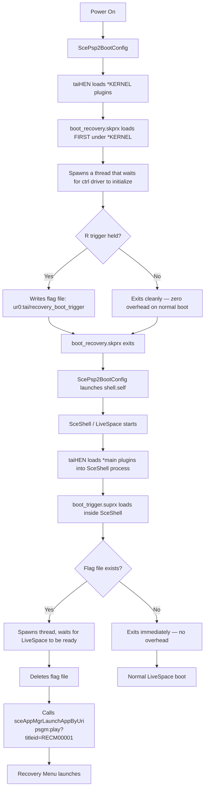

# PS Vita Recovery Menu Project

A diagnostic and recovery environment for the PlayStation Vita with plugin repair tools, storage diagnostics, and boot-time recovery via R trigger.

Hi! I'm Jose (@DrinkingSubset), and this is my first major homebrew project for the PS Vita.

I want to be completely transparent from the start:

I'm **not a full-time or professional developer**. For years, I've had this idea in the back of my mind — a proper, reliable custom recovery menu you could boot into by holding R, something that could really help save bricked or misconfigured Vitas. But learning to code from scratch, especially low-level Vita kernel stuff, felt overwhelming and out of reach.

Thanks to modern AI tools (especially Claude and others), I was finally able to turn that long-held dream into something real. **Most of the code in this project was written with significant help from AI**, which guided me through architecture decisions, fixed bugs, explained Vita-specific internals, and helped structure everything safely. I reviewed, tested, and tweaked every part myself on real hardware, but I could not have built this without that assistance.

I'm sharing this openly because I believe in transparency — especially in the homebrew community where trust and safety matter a lot. This project is a learning journey for me, and I'm proud of how far it's come, but it's far from perfect. If you find issues, have suggestions, or want to contribute fixes/improvements, please feel free to open an issue or pull request. I'd love to collaborate and make it even better together.

Thank you for trying it out, and thank you to the entire Vita homebrew community whose tools, plugins, and knowledge made this possible.

— DrinkingSubset ☣️🟩🥕⚡️🚀

March 2026

---

## ⚠️ Disclaimer

**Read this carefully before using PS Vita Recovery Menu.**

This software is provided **as-is**, with no warranty of any kind. Use it entirely at your own risk.

### What this tool can and cannot do

PS Vita Recovery Menu is designed to assist with **software-level** issues on PS Vita systems running custom firmware (HENkaku, h-encore, h-encore2, Ensō). It can help recover from:

- Corrupted or misconfigured `config.txt` files
- Plugin conflicts causing boot loops
- Broken LiveArea databases
- Misconfigured storage mount points
- General CFW misconfigurations

**This tool cannot recover a fully hard-bricked PS Vita.** If your device does not power on, does not display anything on screen, or has suffered damage at the hardware or NAND level, no software tool — including this one — can help. A hard brick at the hardware level requires physical repair or specialized recovery equipment that is beyond the scope of this project.

### Risk of bricking

Certain operations available in this application — including but not limited to modifying system partitions, deleting core system files, resetting the tai configuration, or applying unsafe plugin configurations — **can result in a soft brick or, in worst-case scenarios, a hard brick of your PS Vita**, rendering it permanently unusable.

This applies to **all PS Vita models**, including:
- PS Vita PCH-1000 / PCH-1001 (OLED)
- PS Vita PCH-1100 / PCH-1101 (OLED 3G)
- PS Vita PCH-2000 / PCH-2001 (Slim LCD)
- PlayStation TV (VTE-1000 / CEM-3000)

### Your responsibility

By using this software, you acknowledge and accept that:

1. You are solely responsible for any damage, data loss, or bricking that occurs to your device.
2. The developer of PS Vita Recovery Menu bears no liability for any outcome resulting from the use of this software.
3. You have a basic understanding of PS Vita custom firmware and the risks involved in modifying system files.
4. You have backed up any important data before performing recovery or restoration operations.

### Recommendations before use

- Always back up `ux0:tai/config.txt` and `ur0:tai/config.txt` before making any changes.
- Use the **Backup tai/** function under Restore / Unbrick before proceeding with any repair operation.
- Test changes on one device before applying to others.
- If unsure about an operation, do not proceed.

**This tool is intended for experienced PS Vita CFW users who understand the risks. It is not a magic fix-all solution and should be treated with the same caution as any other system-level utility.**

### No Liability

The creator and developer of PS Vita Recovery Menu (**DrinkingSubset**) is **not responsible** for any damage, data loss, soft brick, hard brick, or any other consequence that occurs as a result of using this software. This includes but is not limited to: accidental deletion of system files, incorrect configuration changes, failed recovery attempts, or any unintended side effects on your device or data.

**You use this software at your own risk. Full stop.**

---

### Screenshot of the Main Recovery Menu


*Example of the main menu interface on a PS Vita 1000 (OLED)*

---

## PS Vita Recovery Menu v0.1-pre

A custom recovery environment for the PS Vita (and PSTV) running HENkaku / h-encore / Ensō.
Hold R at power-on to boot directly into the recovery menu.
Provides a complete toolkit for plugin management, system diagnostics, unbricking, storage repair, CPU control, and more.

## Features

### Main Menu
* Exit to LiveArea
* Plugins
* Advanced
* System Info
* Restore / Unbrick
* Plugin Fix Mode
* Sony Recovery
* Storage Manager
* File Manager
* Cheat Manager
* Reboot
* Power Off

### Plugin Manager
Toggle any plugin on/off, remove duplicates, clean config.txt, save changes.

### Advanced Tools
* CPU Speed Control — independent ARM / GPU ES4 / BUS / XBR clock domains, persists across reboots
* Registry Hacks
* Reset VSH (restart LiveSpace)
* Suspend / Shut Down / Reboot
* System Write Mode (with full warning dialog)
* Boot Diagnostics
* Boot Recovery Installer

### System Information
Firmware version, model, Ensō status, motherboard series, live clocks, battery health, memory, active tai config path.

### Restore / Unbrick
* Safe Mode Boot
* Reset taiHEN config
* Backup / Restore ux0:tai/
* Rebuild LiveArea Database
* Official Sony recovery options

### Plugin Fix Mode
Safe Mode, View & Toggle, Re-enable All, Reset to Minimal, Backup / Restore config.

### Sony Recovery
Replicas of Sony's safe-mode options (Restart, Rebuild Database, Format Memory Card, Restore System, Update Firmware) with danger warnings.

### Storage Manager (SD2Vita)
Card & config info, mount point switching, StorageMgr install, format tools.

### File Manager
Full partition browser with folder and file operations.

### Cheat Manager
Vita native cheats (.psv) and PSP CWCheat (.db) support.

---

## Installation

Jailbreak required — HENkaku / h-encore / h-encore2 on firmware 3.60–3.74.

1. Download the latest `VitaRecovery.vpk` from the Releases page.
2. Install via VitaShell.
3. Launch the app once from LiveSpace (bubble will appear as Title ID `RECM00001`).
4. Go to **Boot Recovery Installer → Install Boot Recovery**.
   - Copies `boot_recovery.skprx` and `boot_trigger.suprx` to your active tai directory.
   - Inserts both entries into `ur0:tai/config.txt` (or your active config).
   - A backup of your config is automatically created.
5. Reboot holding R to enter the recovery menu.

---

## Build from Source

```bash
export VITASDK=/usr/local/vitasdk
export PATH=$VITASDK/bin:$PATH

cmake -S . -B build -DCMAKE_TOOLCHAIN_FILE=$VITASDK/share/vita.toolchain.cmake
cmake --build build
```

Output: `build/VitaRecovery.vpk`

Requires [VitaSDK](https://vitasdk.org/).

---

## How the R-Trigger Boot System Works

The boot recovery system uses two separate plugins that work together:

```
boot_recovery.skprx  (kernel plugin, loaded under *KERNEL)
boot_trigger.suprx   (user plugin, loaded under *main)
```

**What actually happens at boot:**



**Why two plugins?**

`sceAppMgrLaunchAppByUri` requires SceShell to already be running — it cannot be called from kernel space or before the shell initializes. The kernel plugin (`boot_recovery.skprx`) only writes a flag file. The user plugin (`boot_trigger.suprx`) runs inside the SceShell process where AppMgr is available, reads the flag, and launches the recovery app.

---

## Tested Devices

| Device | Firmware | CFW |
|--------|----------|-----|
| PS Vita PCH-1000 (3G) | 3.65 | Ensō |
| PS Vita PCH-1101 | 3.60 | HENkaku |
| PS Vita PCH-1101 | 3.74 | h-encore2 |
| PS Vita PCH-2001 Slim | 3.65 | Ensō + SD2Vita |

---

## Safety Features

- Never touches `vs0:` / `os0:` unless System Write Mode is manually enabled (with full warning dialog).
- Config backed up before every install/uninstall operation.
- Atomic config writes (`.tmp` → rename) prevent corruption on power loss.
- L-trigger at boot triggers safe mode — disables non-essential plugins before menu opens.
---

## Known Issues

- PS Vita 2000 model detection shows incorrect model name in System Info — under investigation.
- Boot recovery does not work on h-encore2 (3.74) without Ensō, because the kernel hook requires taiHEN to load at coldboot. Normal bubble launch works fine on all firmware versions.

---

## Future Plans

- Vita 2000 model detection fix
- Live taiHEN module reload
- Per-TitleID CPU clock profiles
- Registry editor
- Full Modoru integration for one-click downgrade/restore

---

## Credits & Thanks to the Homebrew Scenes

This recovery menu stands on the shoulders of giants. The PSP and PS Vita homebrew communities have been collaborative, innovative, and persistent for over two decades. Without their exploits, tools, libraries, and shared knowledge, none of this would exist.

### PSP Scene Pioneers (2005–2010) – The Revolution Begins

These trailblazers cracked the PSP wide open, creating the first homebrew enablers and Custom Firmwares (CFW) that inspired everything that followed.

- **Dark_AleX** (Dark Alex) — The absolute legend who started it all. Creator of OE (Open Edition), SE, and M33 series CFW (3.51–5.00+). His work enabled safe homebrew execution and updates on PSPs worldwide. Often called the "father" of PSP modding.
- **Team M33** (including Dark_AleX under pseudonym, Adrahil, Yoshiro/Miriam, Helldashx, and others) — Developed the iconic M33 CFW line after OE/SE. Continued innovations post-2007.
- **Total_Noob** — Long-time PSP developer with tools, plugins, and scene involvement across eras.
- **Fanjita** — Early exploit collaborator with Dark_AleX.
- **nem** — Created the very first PSP exploit (2005 TIFF on 1.0 firmware).
- **Davee** (Team Typhoon) — ChickHEN for newer PSP models (bridged to full CFW).
- Other early notables: Liquidzigong, Team GEN, various PSP-Archive maintainers.

### PS Vita Scene (2016–Present) – Kernel Hacks & Modern Tools

The Vita scene built on PSP foundations with deep reversing and safe, persistent hacks.

- **Team Molecule** (yifanlu, Davee, Proxima, xyz, mathieulh, and others) — The core group that reverse-engineered the Vita kernel. Created **HENkaku** (initial exploit), **taiHEN** (plugin framework), and **Ensō** (permanent coldboot CFW). Their work is the foundation for almost all modern Vita homebrew.
- **TheOfficialFloW** (The Flow) — One of the most prolific Vita developers. Creator of **VitaShell** (essential file manager), **Modoru** (the downgrader), **Adrenaline** (PSP emulator on Vita), and countless tools/utilities.
- **SKGleba** — Modern maintainer and powerhouse. Updated/forked **Modoru** for higher firmwares, created **VitaDeploy** (all-in-one toolbox), enso_ex, IMCUnlock, CBS, and many SD2Vita/storage tools.
- **Freakler** — Tools like ConsoleID, Fingerprint, and various utilities.
- **xerpi** — Vital libraries (ftpvitalib, vita2dlib) used in hundreds of projects.
- **Rinnegatamante** — Massive ports, emulators, and game enhancements.
- **cuevavirus** — Maintained and updated taiHEN.
- **devnoname120** — VHBB (Vita homebrew browser/app store).
- **LiEnby** — Technical corrections and feedback that improved this project's accuracy.
- **Other major contributors** (alphabetical, from GitHub credits, vita.hacks.guide, and community acknowledgments):
  - 173210
  - aerosoul
  - ColdBird
  - cpasjuste
  - der0ad (wargio)
  - dots-tb
  - frangarcj
  - Hykem
  - LemonHaze
  - MajorTom
  - motoharu
  - mr.gas
  - Nkekev
  - PrincessOfSleeping
  - qwikrazor87
  - SilicaAndPina
  - SocraticBliss
  - Sorvigolova
  - St4rk
  - sys (yasen)
  - velocity

### Special Thanks
- The entire **r/vitahacks** community (Reddit) for guides, testing, and support.
- **vita.hacks.guide** maintainers — The definitive modern resource.
- **GameBrew**, **PSDevWiki**, and **PSP-Archive** for preserving history.
- All plugin authors (StorageMgr, rePatch, NoNpDrm, etc.) whose work is used daily.
- Testers, translators, documenters, and everyone who shared knowledge on forums like GBAtemp, PSX-Place, and DCEmu.
